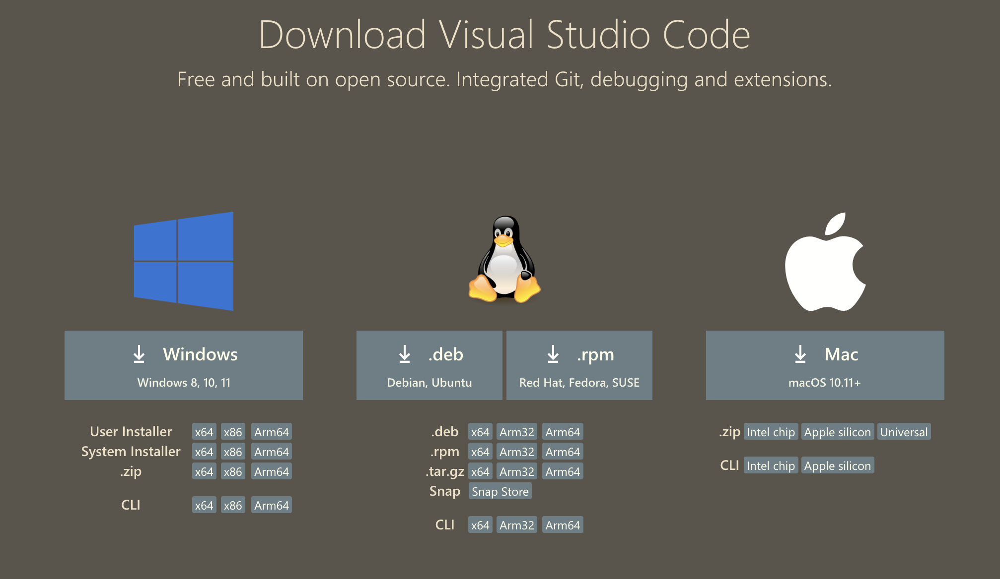
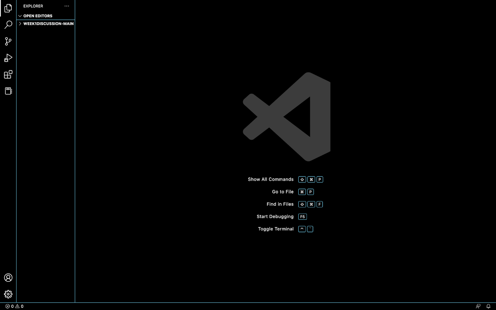
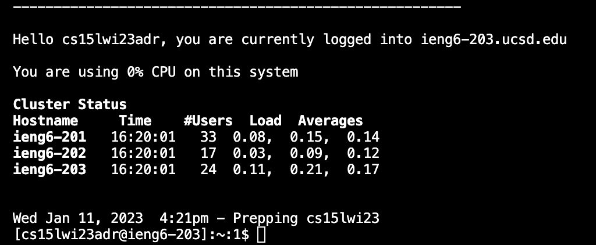
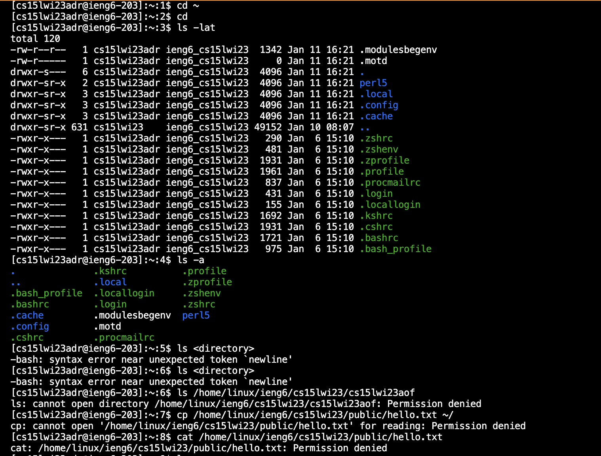

# Lab Report 1: Remote access tutorial
## Step 1
**Installing VScode**
> I already had VS Code on my computer before the lab. But here are the steps anyways.

***
1. Go to the [VS code website](https://code.visualstudio.com/download)
2. Click download button for your OS 

3. Open VS Code on your computer.
That's what you should see:

## Step 2
**Remotely Connecting** 
> I'm using MacOS so the following steps are for MacOS users. *Sorry:,(*
> 
> If you didn't change your password for CSE15L account then do it now [here](https://sdacs.ucsd.edu/~icc/index.php).
> 
> [Tutorial :D](https://docs.google.com/document/d/1hs7CyQeh-MdUfM9uv99i8tqfneos6Y8bDU0uhn1wqho/edit).

***
1. To open the terminal use (control + `)
2. Type in (or *copy*) the following command: `ssh cs15lwi23zz@ieng6.ucsd.edu`. Change "zz" to the combination of letters specific to your account.
3. You will be prompted to confirm your connection to the server. Just type in `yes`.
4. Now type in your password (You won't see your password when typing, but **don't** worry. It's not shown for security measures.)
5. If you see something like this, congrats - ***you are now connected!***

## Step 3
**Trying Some Commands**
> Now that you are fully set up it's time to try some commands.

***
1. Run the following commands `cd`, `ls`, `pwd`, `mkdir`, and `cp` multiple times 
both on **your** computer, and on the **remote** computer (after running ssh command described in Step 2). 
2. Run some more commands. You may try the following list:
- `cd ~`
- `cd`
- `ls -lat`
- `ls -a`
- `ls /home/linux/ieng6/cs15lwi23/cs15lwi23zzz`, where the `zzz` is substituted by your groupmate's username
- `cp /home/linux/ieng6/cs15lwi23/public/hello.txt ~/`
- `cat /home/linux/ieng6/cs15lwi23/public/hello.txt`
3. Your output should look similar to this:

