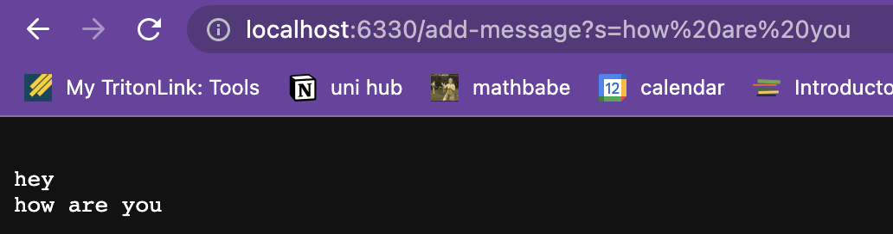
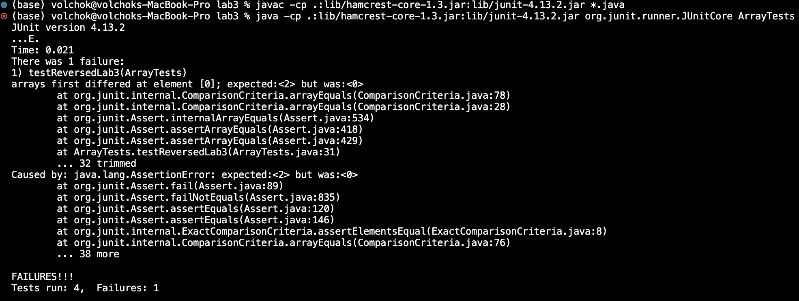

## Part 1
Couldn't do part one because my code doesn't work. I'm confused:(
```
import java.io.IOException;
import java.net.URI;

class Handler implements URLHandler {

    String string = "";

    public String handleRequest(URI url) {
        if (url.getPath().equals("/")) {
            return String.format("Current message: %s", string);
        }
        else {
            System.out.println("Path: " + url.getPath());
            if (url.getPath().contains("/add-message")) {
                String[] parameters = url.getQuery().split("=");
                if (parameters[0].equals("s")) {
                    string = string + "\n" + parameters[1];
                    return string;
                }
            }
        }
        return "404 Not Found!";
    }
}

class StringServer {
    public static void main(String[] args) throws IOException {
        if(args.length == 0){
            System.out.println("Missing port number! Try any number between 1024 to 49151");
            return;
        }

        int port = Integer.parseInt(args[0]);

        Server.start(port, new Handler());
    }
}

```
example 1:

- Which methods in your code are called?
handleRequest and main methods are called
- What are the relevant arguments to those methods, and the values of any relevant fields of the class?
For main method it checks the command line args. In our case it checks whether we provided the port number for the server.
For handleRequest method in Handler class it takes in the url as an argument. 
- How do the values of any relevant fields of the class change from this specific request?
If no values got changed, explain why.
If url contains "/add-message", the query string is taken into parameters list. Then the string after "=" is added to the initial string value
along with a new line. So, for "hey" we have "" + new line + "hey" as a result.
example 2:

- Which methods in your code are called?
handleRequest and main methods are called
- What are the relevant arguments to those methods, and the values of any relevant fields of the class?
For main method it checks the command line args. In our case it checks whether we provided the port number for the server.
For handleRequest method in Handler class it takes in the url as an argument. 
- How do the values of any relevant fields of the class change from this specific request?
If no values got changed, explain why.
If url contains "/add-message", the query string is taken into parameters list. Then the string after "=" is added to the initial string value
along with a new line. So, for "how are you" we have "" + new line + "hey" + new line + "how are you" as a result.
## Part 2
1) A failure-inducing input for the buggy program, as a JUnit test and any associated code
``` 
@Test
public void testReversedLab3() {
  int[] input1 = { 1, 2 };
  assertArrayEquals(new int[]{ 2, 1 }, ArrayExamples.reversed(input1));
    
  int[] input2 = { 1, 2, 3, 4, 5 };
  assertArrayEquals(new int[]{ 5, 4, 3, 2, 1 }, ArrayExamples.reversed(input2));
}
```
2) An input that doesn’t induce a failure, as a JUnit test and any associated code
```
@Test
public void testReversed() {
  int[] input1 = { };
  assertArrayEquals(new int[]{ }, ArrayExamples.reversed(input1));
}
```
3) The symptom, as the output of running the tests

4) The bug, as the before-and-after code change required to fix it

before:
```
// Returns a *new* array with all the elements of the input array in reversed
// order
static int[] reversed(int[] arr) {
  int[] newArray = new int[arr.length];
  for(int i = 0; i < arr.length; i += 1) {
    arr[i] = newArray[arr.length - i - 1]; //buggy
  }
  return arr; //buggy
}
```
after:
```
// Returns a *new* array with all the elements of the input array in reversed
// order
static int[] reversed(int[] arr) {
  int[] newArray = new int[arr.length];
  for(int i = 0; i < arr.length; i += 1) {
    newArray[i] = arr[arr.length - i - 1]; //switch newArray and arr
  }
  return newArray; //return newArray instead of arr
}
```
The fix addresses the issue by fixing the switching of the elements in the for loop 
and the returned value in the return statement. The buggy code assigns the original array
with the flipped values of an empty new array, so values are 0. No switch in the original array is happening.
## Part 3
### Learning outcomes of lab 2 and lab 3:
- I learned how to create and run my own Java server
- I also learned how to debug code written by someone else. *It is actually way harder than debugging your own
as you have to familiarize yourself with the code first, understand how it works and test it out thotoughly.*
