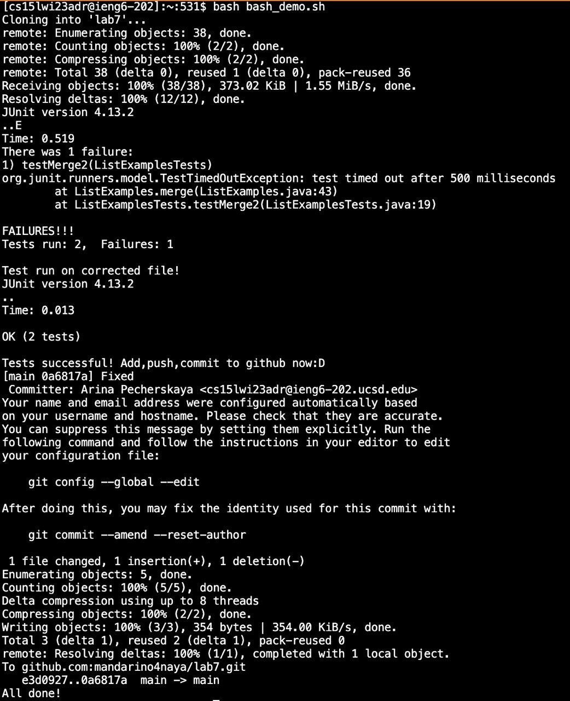

### Lab report 5

> I picked to work on this prompt "For lab report 4 (about doing commands quickly),
> how could you have done the task very quickly by writing a bash script (even if that was against the rules)"

## What I did
1) I created 2 bash script files on the ieng6 server. One handling the part before editing the file in nano, the other - for after nano edits are done and saved. 
2) The code of bash_demo.sh file calling the other bash script in the end:
```
CPATH='.:lib/hamcrest-core-1.3.jar:lib/junit-4.13.2.jar'
rm -rf lab7/
git clone git@github.com:mandarino4naya/lab7.git
cp bash_cntd.sh lab7/
cd lab7/ 
javac -cp $CPATH *.java
java -cp $CPATH org.junit.runner.JUnitCore ListExamplesTests
nano ListExamples.java
bash bash_cntd.sh
```
3) The code of bash_cntd.sh file:
```
CPATH='.:lib/hamcrest-core-1.3.jar:lib/junit-4.13.2.jar'
echo "Test run on corrected file!"
javac -cp $CPATH *.java
java -cp $CPATH org.junit.runner.JUnitCore ListExamplesTests
echo "Tests successful! Add,push,commit to github now:D"
git add ListExamples.java
git commit -m "Fixed"
git push origin main
echo "All done!"
```
## What is the result
1) To complete this task I only have to run two lines of code:
- log in to the ieng6 server using `ssh cs15lwi23adr@ieng6.ucsd.edu`
- run the bash script using `bash bash_demo.sh` (use <tab> to autofill the line for the script name)

2) The result is in the screenshot: 
