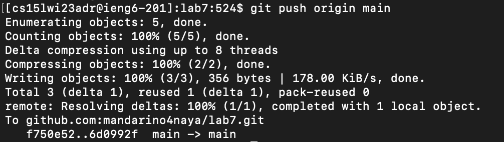

# Lab report 4

## Step 1:
`<up><up><enter>` - the  `ssh cs15lwi23***@ieng6.ucsd.edu` command was 2 up in the search history,
so I used up arrow to access it.

## Step 2:
`<up>x13<enter>` - the  `git clone git@github.com:mandarino4naya/lab7.git` command was 13 up in the search history,
so I used up arrow to access it.

## Step 3:
`cd l<tab> <enter>` - to access `cd lab7/` command I typed `cd l`, and hit tab to autofill it.

## Step 4:
`<up>x13<enter>` - the  `javac -cp .:lib/hamcrest-core-1.3.jar:lib/junit-4.13.2.jar *.java` command was 13 up in the search history,
so I used up arrow to access it.

## Step 5:
`<up>x12<enter>` - the  `java -cp .:lib/hamcrest-core-1.3.jar:lib/junit-4.13.2.jar org.junit.runner.JUnitCore ListExamplesTests` 
command was 12 up in the search history, so I used up arrow to access it.

## Step 6:
`nano L<tab>.j<tab><enter>` - to access `nano ListExamples.java` command I typed `nano L`, hit tab, typed `.j` and hit tab again.

## Step 7:
`<ctrl+W>while(index2<enter>`, then `<down><down><right>x8<backspace>2`, then `<ctrl+O><enter><ctrl+X>` - I searched for the right spot in the code.
Then I hit arrow down 2 times and arrow right 8 times. I hit backspace once and typed 2 instead of 1. Finally I saved changes and quit nano.

## Step 8:
`<up><up><enter>` - the  `javac -cp .:lib/hamcrest-core-1.3.jar:lib/junit-4.13.2.jar *.java` command was 2 up in the search history,
so I used up arrow to access it.

## Step 9:
`<up><up><enter>` - the  `java -cp .:lib/hamcrest-core-1.3.jar:lib/junit-4.13.2.jar org.junit.runner.JUnitCore ListExamplesTests` command was 2 up in the search history,
so I used up arrow to access it.

## Step 10:
`git add L<tab>.j<tab><enter>` - the  `git add ListExamples.java"` I used tab to access it.

## Step 11:
`git commit -m "Fixed"<enter>` - the  `git commit -m "Fixed"` I typed it in full to access it.

## Step 12:
`git push o<tab> m<tab><enter>` - the  `git push origin main` I used <tab> to access it.

